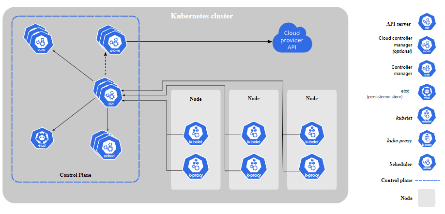

# Kubernetes

> O Kubernetes (também conhecido como k8s ou "kube") é uma plataforma de orquestração de containers open source que automatiza grande parte dos processos manuais necessários para implantar, gerenciar e escalar aplicações em containers.

Este repositório apresenta uma aplicação Rest API (`/api`) e os arquivos de configurações para deploy da aplicação 
(`/k8s`) num cluster Kubernetes.

## Arquitetura do Kubernetes

O Kubernetes possui vários componentes, cada um com seu propósito, garantindo que exista uma separação na responsabilidade 
e que o sistema seja resiliente:

Os componentes acima correspondem a estrutura necessária para a gerência de um ambiente Kubernetes, no caso, são executados 
em um NODE, que pode ser físico ou virtual, dependendo da estrutura do cluster. O NODE Master é responsável por gerenciar 
o cluster Kubernetes e suas cargas de trabalho e/ou aplicações que é possível através destes componentes:

### PODs

POD é a menor unidade que pode ser trabalhada no Kubernetes. É possível inserir 1 ou mais containers dentro de uma POD e 
ambos irão compartilhar os mesmos recursos disponíveis. 

### Componentes Master (Control Plane)
#### API Server

É um componente do NODE Master que expõe a API do Kubernetes, sendo o API Server front-end. É o “cérebro” do cluster, 
as solicitações passam pela API, bem como a gravação no banco de dados interno do Kubernetes também é feita pela API.

#### ETCD

É a solução que o Kubernetes utiliza como banco de dados para armazenar as informações pertinentes ao cluster. O ETCD não 
é uma solução que foi desenvolvida para o K8s, ele somente utiliza a solução já existente. Todas as informações sobre 
banco de dados ETCD podem ser encontradas na sua documentação oficial.

#### Scheduler 

Componente que observa os PODs recém-criados sem nenhum nó atribuído e seleciona um nó para executá-los. Quando você 
solicita a API para criar um container, ela irá conversar com o Scheduler para saber qual nó está disponível para alocar 
o container, bem como verificar se não há nenhum requisito de hardware (como memória RAM ou CPU) ou qualquer política.

#### Controller Manager 

Componente que executa os processos do controlador. Logicamente, cada controlador é um processo separado, mas para reduzir 
a complexidade, todos são compilados em um único binário e executados em um único processo. Por exemplo: Replicaset Controller.

O controller Replicaset é responsável por garantir que as quantidades de PODs definidas estejam de acordo. Então quando 
você define que o Replicaset precisará ter 5 Pods, caso algum container caia ou seja destruído, o Replicaset irá forçar a 
criação de uma nova POD. Quem gerencia esse controlador, no caso, é o Controller Manager que observa os estados dos controladores 
sendo que alguns deles: Job controller, Deployment, Endpoints etc.

### Componentes Node
Os componentes a seguir são executados em todos os NODES.

#### Kubelet 

O Kubelet é um agente que é executado em cada NODE. Ele garante que os containers estão sendo executados através das PODs. 
Também fornece uma comunicação entre todos os NODEs que compõem o seu cluster, tendo o estado e saúde de cada NODE.

#### Kube-proxy

kube-proxy é um proxy de rede executado em cada nó do cluster, implementando parte do conceito de serviço Kubernetes. O 
kube-proxy mantém regras de rede em nós. Essas regras de rede permitem a comunicação de rede com seus PODs a partir de 
sessões de rede dentro ou fora do cluster.

#### Container Runtime

No caso se trata da aplicação que irá executar os containers para nós. Pode ser o Docker, containerd, cri-o, podman etc.

#### Addons

Funcionam como um plugin, utilizando recursos do Kubernetes para implementar soluções adicionais ao cluster.

#### DNS

Enquanto outros ADDONs não são obrigatórios, todo cluster Kubernetes requer uma solução de DNS, dessa forma facilita o 
alcance e registros dos serviços.

## Expondo serviços

Embora cada Pod tenha um endereço IP único, estes IPs não são expostos externamente ao cluster sem um objeto Service. 
Objetos Service permitem que suas aplicações recebam tráfego. Services podem ser expostos de formas diferentes especificando 
um tipo (campo type) na especificação do serviço (campo spec):

* **ClusterIP (padrão)** - Expõe o serviço sob um endereço IP interno no cluster. Este tipo de serviço é acessível somente dentro do cluster.
* **NodePort** - Expõe o serviço sob a mesma porta em cada nó selecionado no cluster usando NAT. Torna o serviço acessível externamente ao cluster usando o endereço <NodeIP>:<NodePort>. É um superconjunto do tipo ClusterIP.
* **LoadBalancer** - Cria um balanceador de carga externo no provedor de nuvem atual (se suportado) e atribui um endereço IP fixo e externo para o serviço. É um superconjunto do tipo NodePort.
* **ExternalName** - Mapeia o Service para o conteúdo do campo externalName (por exemplo, foo.bar.example.com), retornando um registro DNS do tipo CNAME com o seu valor. Nenhum tipo de proxy é configurado. Este tipo requer a versão 1.7 ou mais recente do kube-dns, ou o CoreDNS versão 0.0.8 ou superior.

## Tecnologias

* Node.js 20
* Express Framework
* Kubernetes 
* Docker
* Minikube
